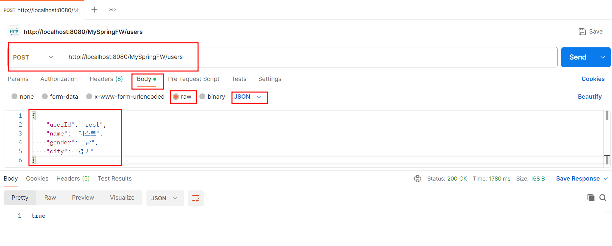
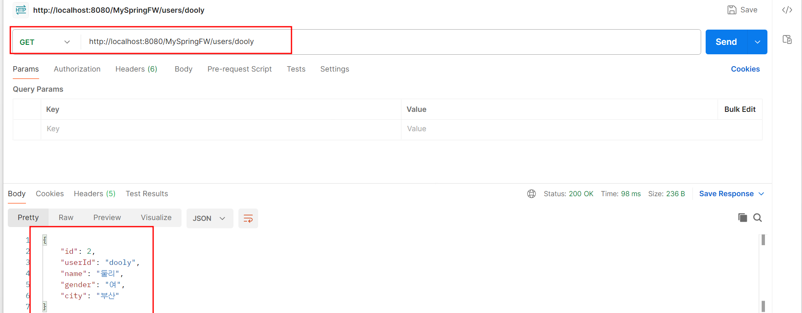

### Users REST API
* 등록

```
  POST
  http://localhost:8080/MySpringFW/users

  header
     content-type:application/json

  body
{
    "userId": "rest",
    "name": "레스트",
    "gender": "남",
    "city": "경기"
}
```

      
* userId로 조회
```
    GET
    http://localhost:8080/MySpringFW/users/dooly

```


* 목록조회
```
    GET
    http://localhost:8080/MySpringFW/users

```

* 수정
```
    PATCH
    http://localhost:8080/MySpringFW/users/dooly

  	header
     	content-type:application/json
    
    body
      {
         "city": "대전"
      }
      
```

* 삭제
```
    DELETE
    http://localhost:8080/MySpringFW/users/dooly
```

#### Tomcat에 배포했을 때 발생하는 오류 해결

* 둘 이상의 fragment들이 발견되었습니다. 이는 상대적 순서배열에서 불허됩니다. 
* 상세 정보는 서블릿 스펙 8.2.2 2c 장을 참조하십시오. 
* 절대적 순서배열을 사용하는 것을 고려해 보십시오.

* web.xml 
* <absolute-ordering />태그 추가
```
<web-app xmlns:xsi="http://www.w3.org/2001/XMLSchema-instance" xmlns="http://xmlns.jcp.org/xml/ns/javaee" 
	xsi:schemaLocation="http://xmlns.jcp.org/xml/ns/javaee http://xmlns.jcp.org/xml/ns/javaee/web-app_3_1.xsd" 
	id="WebApp_ID" version="3.1">
		
  <display-name>CustomerSpringWeb</display-name>
  
  <absolute-ordering />
  
```
